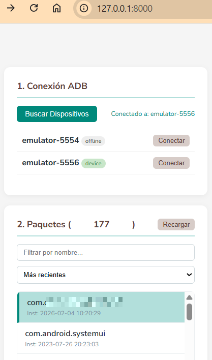
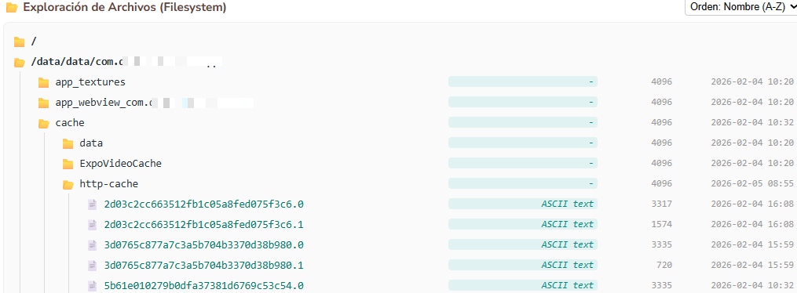
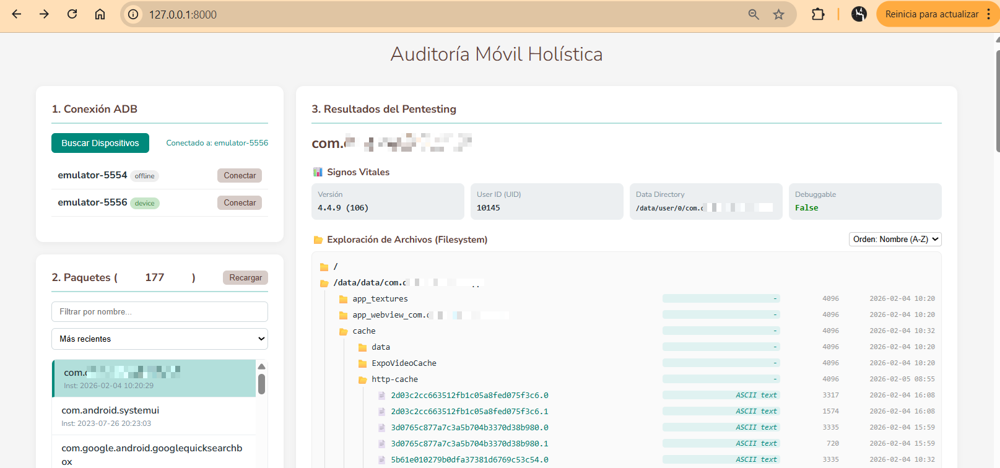

# 🧘 Auditoría Móvil Consciente (Holistic Mobile Auditor)

> *"Observar la aplicación no como un objeto estático, sino como un flujo de energías, intenciones y permisos."*

Una herramienta de pentesting y análisis estático/dinámico para Android que busca el equilibrio (*Sattva*) entre la profundidad técnica y la claridad visual. Utiliza ADB para extraer la esencia (`dumpsys`, `logcat`, sistema de archivos) y presentarla en un Canvas unificado que facilita la comprensión de la postura de seguridad de una aplicación.


*(Etiqueta para tu captura: Vista general mostrando la lista de dispositivos y paquetes)*

## 🌟 Filosofía del Proyecto

Las herramientas de auditoría tradicionales suelen ser ruidosas o excesivamente complejas. **Auditoría Móvil Consciente** busca:
1.  **Claridad:** Transformar datos crudos (`dumpsys`) en información digerible.
2.  **Acción:** Generar "Mantras" (comandos ADB) listos para usar, reduciendo la fricción entre el análisis y la prueba de concepto.
3.  **Profundidad:** Acceder a los rincones ocultos (archivos internos, logs, intents no exportados explícitamente) sin necesidad de herramientas pesadas.

## ☸️ Funcionalidades (Los Chakras del Sistema)

La herramienta analiza los siguientes centros de energía de la aplicación:

### 1. 📊 Signos Vitales
Diagnóstico inmediato de la salud base de la aplicación:
* Detección de modo `debuggable` (Riesgo activo).
* Identificación de UID y rutas de datos.
* Versiones y fechas de instalación.

### 2. 📂 Exploración de Archivos (Filesystem)
Navegación consciente por el sistema de archivos de la app (`/data/data/...`):
* Visualización de árbol de directorios.
* Lectura de archivos de texto y extracción de cadenas ("Esencia").
* **Vista previa de imágenes** y base64.
* Identificación de tipos de archivo (Magic numbers).


*(Etiqueta para tu captura: Modal mostrando el contenido de un archivo o el árbol de directorios)*

### 3. 🛡️ Permisos y Fronteras
Análisis del consentimiento y los límites:
* Diferenciación clara entre permisos **Solicitados** y **Concedidos**.
* Alerta visual de **Permisos Peligrosos** (Riesgo activo).

### 4. 🔗 Conexión Universal (App Links & Schemes)
Auditoría de los canales de entrada:
* **Deep Links (Schemes):** Listado de protocolos personalizados (ej: `fiado://`).
* **App Links (Android 12+):** Verificación de estado de dominios (`Verified`, `Legacy/1024`, `Disabled`).
* Generación automática de comandos para probar la apertura de enlaces.

### 5. ⚡ Intenciones y Componentes
* **Intents:** Filtros de intención organizados por categorías.
* **Componentes Públicos:** Actividades exportadas listas para ser invocadas directamente (`-n package/.Activity`).
* **Mantras ADB:** Al hacer clic en cualquier etiqueta, se copia al portapapeles el comando ADB exacto para estimular esa acción.

### 6. 📜 Escucha Profunda (Logcat)
Sintonización automática de los logs filtrados específicamente por el `UID` de la aplicación seleccionada, eliminando el ruido del sistema.

---

## 🛠️ Instalación y Puesta en Marcha

### Prerrequisitos
* Python 3.8+
* ADB instalado y accesible en el PATH del sistema (o configurado en el script).
* Un dispositivo Android (físico o emulador) con depuración USB activa.

### Pasos

1.  **Clonar el repositorio:**
    ```bash
    git clone https://github.com/m4ndingo/Auditoria-Movil-Holistica.git
    cd auditoria-movil-consciente
    ```

2.  **Instalar dependencias (Entorno Virtual recomendado):**
    ```bash
    pip install fastapi uvicorn nest_asyncio
    ```

3.  **Iniciar el servidor:**
    ```bash
    python auditor_unified.py
    ```

4.  **Acceder al Canvas:**
    Abre tu navegador (preferiblemente Chrome/Brave) y visita:
    `http://127.0.0.1:8000`

---

## 🎮 Uso

1.  La herramienta detectará automáticamente tu dispositivo Android.
2.  Selecciona un paquete de la lista (ordenada por fecha reciente por defecto).
3.  Observa cómo se despliega la información en el panel derecho.
4.  **Interactúa:** Haz clic en los esquemas, acciones o componentes para copiar los comandos de prueba.


*(Etiqueta para tu captura: Panel de detalles mostrando intents y permisos)*

## 🤝 Contribuciones (Karma Yoga)

Cualquier contribución que busque mejorar la claridad, la estabilidad o la profundidad de la herramienta es bienvenida. Por favor:
1.  Haz un Fork del proyecto.
2.  Crea una rama consciente (`git checkout -b feature/nueva-energia`).
3.  Envía un Pull Request.

## 📄 Licencia

Este proyecto se distribuye bajo la licencia MIT. Úsalo con responsabilidad y consciencia ética.

---
*Namasté.* 🙏
